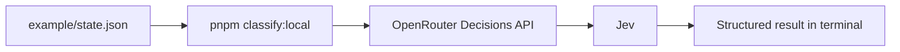
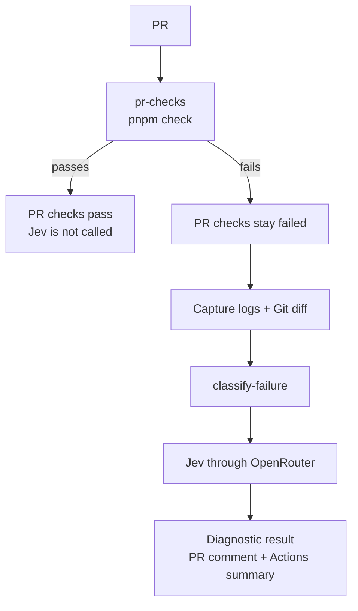

<h1 align="center">Jev CI Classifier</h1>

<p align="center">
  This repo was created for an article <a href="https://technway.biz/en/blog/using-jev-for-structured-decisions-in-software-development/">Using Jev for Structured Decisions in Software Development</a>, where I wanted to test Jev with a real technical example instead of only explaining how it works. The example uses Jev to classify failed PR checks and adds the result as extra diagnostic information without changing whether the PR checks pass or fail.
</p>

<div align="center">
  
</div>

## What it checks

| Question             | Type     | What it tells us                                           |
| -------------------- | -------- | ---------------------------------------------------------- |
| `failure_category`   | `choice` | Which part of the checks failed                            |
| `change_related`     | `noul`   | The probability that the current change caused the failure |
| `diagnostic_clarity` | `score`  | How clearly the logs identify the cause                    |

## Requirements

- Node.js 24 or newer
- pnpm 10
- An [OpenRouter](https://openrouter.ai/) API key

The project uses TypeScript directly through Node.js, so there is no TypeScript build step.

## Setup

Install the dependencies:

```
pnpm install
```

Create your local environment file:

```
cp .env.example .env.local
```

Then add your OpenRouter API key:

```env
OPENROUTER_API_KEY=your_key_here
```

## Try it locally

The repo includes an example CI failure in [`example/state.json`](example/state.json). Run it with:

```
pnpm classify:local example/state.json
```

No PR is needed for this. The command loads the key from `.env.local`, sends the example state to Jev, and prints the result in the terminal.



The state contains the information Jev needs to inspect:

```json
{
  "job": {
    "name": "quality",
    "command": "pnpm check",
    "exit_code": 1
  },
  "change": {
    "changed_files": ["example/cart.ts"],
    "diff": "..."
  },
  "logs": "..."
}
```

You can create other state files and classify them the same way:

```
pnpm classify:local path/to/state.json
```

## What Jev returns

The classifier keeps the results from all three Jev question types. A shortened response looks like this:

```json
{
  "failureCategory": {
    "value": "test_failure",
    "confidence": 1,
    "probabilities": {
      "lint_failure": 0,
      "type_failure": 0,
      "test_failure": 1,
      "dependency_failure": 0,
      "ci_environment_failure": 0,
      "unknown": 0
    }
  },
  "changeRelated": {
    "probability": 0.75
  },
  "diagnosticClarity": {
    "score": 1.67,
    "confidence": 0.5,
    "probabilities": {
      "0": 0,
      "1": 0.33,
      "2": 0.67
    }
  },
  "response": {
    "model": "typesafe/jev-1.13-20260917",
    "usage": {
      "input_tokens": 714,
      "output_tokens": 94,
      "cost": 0.000029988
    }
  }
}
```

The exact probabilities will change between inputs and model versions.

`changeRelated.probability` stays as the original `Noul` probability. The classifier does not convert it into `true` or `false`, because deciding what probability is high enough belongs to the application using the result.

The complete response is also preserved under `response`, including the model version, token usage, cost, and original Jev answers.

## The questions

The questions are defined in [`src/questions.ts`](src/questions.ts).

### Failure category

`failure_category` is a `Choice`.

Jev chooses between:

- `lint_failure`
- `type_failure`
- `test_failure`
- `dependency_failure`
- `ci_environment_failure`
- `unknown`

The result also includes the probability of every option and a confidence value.

`dependency_failure` is only reached when the compiler reports a missing module. If `pnpm install` fails earlier, Jev is not called.

### Related to the current change

`change_related` is a `Noul`.

It asks whether the edits in the PR caused the failure.

The state includes the diff, not only the changed file names, so Jev can compare the actual code changes with the failure output.

The answer is a probability from `0` to `1`.

For example:

```json
{
  "probability": 0.75
}
```

This means Jev gives a `0.75` probability to the answer being yes. It does not mean the classifier automatically decides that the change caused the failure.

### Diagnostic clarity

`diagnostic_clarity` is a `Score` with three levels:

| Level | Meaning                                                                                                   |
| ----- | --------------------------------------------------------------------------------------------------------- |
| `0`   | The output only reports that a step failed without identifying a file, rule, assertion, or error location |
| `1`   | The output identifies a file, rule, or assertion, but does not provide a line number or concrete mismatch |
| `2`   | The output provides a line number or a concrete expected-versus-actual mismatch                           |

The final score can be between these levels because it is calculated from the probability distribution.

The levels are written so the same log should not clearly fit more than one level.

## Using it in PRs

The repo includes a GitHub Actions workflow in [`.github/workflows/pr-checks.yml`](.github/workflows/pr-checks.yml). It runs on every PR.

There are two checks:

1. PR checks / pr-checks
2. PR checks / classify-failure

`pr-checks` runs:

```
pnpm check
```

This runs linting, type checking, and tests.

If the checks pass, nothing else happens and Jev is not called.

If the checks fail, the workflow captures information about the failure and runs the second job, `classify-failure`.



## What is sent to Jev from CI

The workflow does not send the complete GitHub Actions log. It creates a `failure-state.json` containing:

- the failed command
- its exit code
- files changed by the PR
- the diff of those files
- the last part of the failed command output

The captured output is limited to the last 200 lines and a maximum of 16 KB. The diff is limited to 8 KB, and `pnpm-lock.yaml` is excluded to keep the state small.

The generated state looks roughly like:

```json
{
  "job": {
    "name": "quality",
    "command": "pnpm check",
    "exit_code": 1
  },
  "change": {
    "changed_files": ["example/cart.ts"],
    "diff": "..."
  },
  "logs": "..."
}
```

Keeping the state focused gives Jev the information needed for the decision without sending unrelated CI output.

The captured command output should still be considered potentially sensitive. A failed command can print information that should not be sent to an external service, so real projects may need additional filtering or redaction.

> [!NOTE]
> This example only classifies failures from `pnpm check`. If `pnpm install --frozen-lockfile` fails earlier, no failure state is created and Jev is not called.

## PR comment

When Jev successfully classifies a failed PR, the result is added to the GitHub Actions summary and posted directly on the PR.

> [!NOTE]
> PRs from forks skip Jev classification because repository secrets such as `OPENROUTER_API_KEY` are not exposed to them.

## Using the classifier from code

The CI integration is only one example. `classifyCIFailure` can also be called directly:

```ts
import { classifyCIFailure } from './src/classifier.ts';

const result = await classifyCIFailure(process.env.OPENROUTER_API_KEY!, {
  job: {
    name: 'quality',
    command: 'pnpm check',
    exit_code: 1,
  },
  change: {
    changed_files: ['example/cart.ts'],
    diff: failureDiff,
  },
  logs: failureLogs,
});

console.log(result.failureCategory);
console.log(result.changeRelated);
console.log(result.diagnosticClarity);
```

The classifier validates the response before returning it. Unexpected answer types, unknown categories, invalid probabilities, and invalid scores cause an error instead of silently being converted into another result.

## Changing the questions

The Jev questions live in [`src/questions.ts`](src/questions.ts).

The current example uses all three Jev primitives:

```text
Choice  failure_category
Noul    change_related
Score   diagnostic_clarity
```

You can change the questions and criteria to match another workflow without changing the OpenRouter integration.

The [`evaluateWithJev`](src/openrouter.ts) function accepts any supported question set, so the same OpenRouter integration can be reused for other Jev questions.

## Cost

Every Jev response includes its token usage and actual OpenRouter cost under `response.usage`.

Current Jev pricing can be checked on the [OpenRouter model page](https://openrouter.ai/models?q=jev).

Because Jev is only called after a PR check fails, passing PRs do not make Jev requests in this example.

## License

MIT
